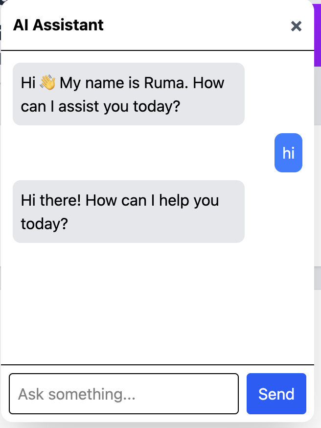

# Monorepo Ecommerce App

A fullstack ecommerce monorepo built with Next.js, Turborepo, Zustand, and Tailwind CSS.

## Live Demo

### Client App
https://monorepo-ecommerce-app-client.vercel.app

### Admin Dashboard
https://monorepo-ecommerce-app-admin.vercel.app

---

## Tech Stack

- Next.js
- Turborepo
- TypeScript
- Tailwind CSS
- Zustand
- Framer Motion
- n8n AI Workflow
- Vercel

---

## Apps

### Client App

Features:
- Product listing
- Product details
- Add to cart
- Checkout flow
- Success page
- Responsive UI

### Admin Dashboard

Features:
- Dashboard layout
- Sidebar navigation
- Product management UI
- Responsive admin panel
- AI Assistant chatbot integration

---

## AI Assistant

AI-powered chatbot integrated into the Admin Dashboard using n8n workflow automation.

Features:
- Real-time chat interaction
- AI-generated responses
- Webhook-based communication
- Ecommerce assistant functionality

---

## Screenshots

### AI Assistant



---

## Monorepo Structure

```bash
apps/
  admin/
  client/

packages/
```

---

## Getting Started

Install dependencies:

```bash
pnpm install
```

Run development server:

```bash
pnpm dev
```

Build project:

```bash
pnpm build
```

---

## Deployment

Deployed on Vercel.

Client:
https://monorepo-ecommerce-app-client.vercel.app

Admin:
https://monorepo-ecommerce-app-admin.vercel.app
